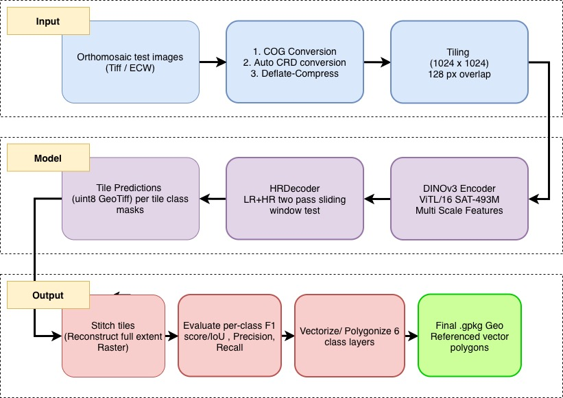
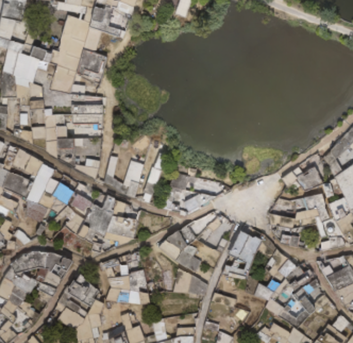
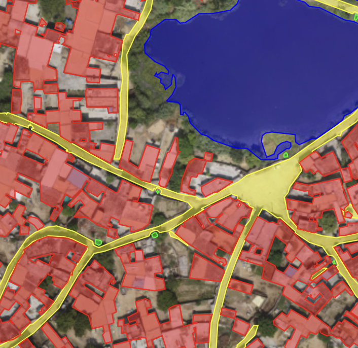
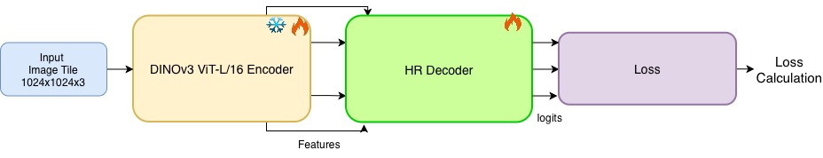

# DINOv3 + HRDecoder Segmentation Pipeline 


<p align="center"><em>The Di2S2-Net portal: browse pre-computed results or launch a fresh inference on a new orthomosaic, then swipe-compare imagery against the extracted features — live.</em></p>

End-to-end pipeline for **tile-based semantic segmentation of aerial /
satellite orthoimagery**, producing per-class raster masks and vector
GeoPackages for six feature classes: Built_Up_Area, Road, Water_Body,
Utility, Bridge, Railway.

This **GitHub repository holds the code only** (~7 MB). The heavy assets —
raw rasters, COGs, trained checkpoints, precomputed results, and the
portal's result library — live on **Google Drive** because they total
~120–150 GB. After you extract the Drive archive into the repo root, the
bundle becomes fully self-contained and the folders land exactly where the
code expects them (the bundle *is* the workspace).

---

## 0. Getting the data, weights & results (Google Drive)

**Drive folder:** <PASTE GOOGLE DRIVE LINK HERE>

The Drive folder mirrors this repo's layout, so extracting it **into the
repo root** merges the heavy folders into place — no manual wiring.

```bash
# 1. Clone the code
git clone <this-repo-url> svamitva && cd svamitva

# 2. Download the Drive folder and MERGE its contents into the repo root
#    (it mirrors this layout, so folders drop straight into place):
#      - single zip:   unzip svamitva_data_and_results.zip -d .
#      - per-folder:    unzip data.zip -d . && unzip cog.zip -d . && ...
#      - Drive folder:  copy dataset/ cog/ pretrained/ outputs/ here
#    → now populated: dataset/  cog/  pretrained/*.ckpt  outputs/{gpkg,evaluation}/

# 3. Build the environment (conda env, deps, clones DINOv3, rewrites
#    config paths to THIS directory, installs npm deps)
bash setup_env.sh
conda activate svamitva2

# 4a. Launch the portal (backend :8000 + frontend :5173)
bash start_portal.sh
# 4b. …or run the CLI pipeline on one dataset
python -m dinov3_hrdecoder_pipeline.inference.run_pipeline \
    --checkpoint pretrained/dinov3_hrdecoder_full_best_loss=0.0615.ckpt \
    --datasets BASANTPUR_434297_ORTHO
```

| Drive folder | Merges into | Needed for |
|---|---|---|
| `dataset/` | `dataset/` | images + labels organized by `train\|test / CG\|PB` (no cog subfolder); the 20 source rasters + train ground-truth shapefiles |
| `cog/` | `cog/` | imagery the portal displays — **all 20 datasets** |
| `pretrained/*.ckpt` | `pretrained/` | the 4 trained checkpoints (real ~2.3 GB files) |
| `outputs/gpkg/` | `outputs/gpkg/` | vector predictions (portal's Predictions layer) — however many are generated |
| `outputs/evaluation/` | `outputs/evaluation/` | per-class IoU/F1 metrics CSVs |

> **Imagery (COG) ships for all 20 datasets**, so every one is browsable on
> the portal. **Prediction GPKGs ship for whichever datasets have been
> vectorized** — the rest can be added anytime with
> `python -m dinov3_hrdecoder_pipeline.inference.batch_stitched_to_gpkg`.
> Only `outputs/evaluation/*.csv` ships in this repo as a preview; COGs and
> GPKGs come from Drive.

> **Not shipped — regenerated on demand** (all regenerable, none read for
> library display): `outputs/stitched/` (raster preds — the portal uses the
> GPKG instead), `outputs/predictions/` (per-tile masks), `tiles/` + `masks/`
> (training tiles/labels — inference cuts its own), and all of
> `portal_workspace/` (portal-triggered runs rebuild it on demand). To
> **re-train**, first rebuild tiles/masks:
> `python -m dinov3_hrdecoder_pipeline.data_prep.tile_raster` then
> `... prepare_masks --mode multiclass`.

> **Checkpoints note:** `pretrained/*.ckpt` on Drive are the real ~2.3 GB
> files (this repo ships none — only `pretrained/README.md`). The default
> inference checkpoint is `pretrained/dinov3_hrdecoder_full_best_loss=0.0615.ckpt`.

---

## 1. Architecture

**End-to-end pipeline — raw orthomosaic → GIS-ready GeoPackage:**



**What it produces — a raw drone tile in, GIS-ready vector features out:**

| Input · raw drone orthomosaic | Output · extracted feature layers |
|:---:|:---:|
|  |  |

<p align="center"><em>Built-Up Area (red) · Road (yellow) · Water Body (blue) · Utility (green) — vectorised polygons/lines/points, georeferenced and ready for QGIS/ArcGIS.</em></p>

**Model — DINOv3 ViT-L/16 encoder → HRDecoder → multi-term loss:**



- **Encoder**: DINOv3 ViT-L/16 (~300 M params), pretrained on the
  satellite-imagery SAT-493M dataset. Multi-scale intermediate
  features at transformer blocks 5, 11, 17, 23.
- **Decoder**: HRDecoder. Two-pass design — a low-resolution pass for
  global context and a high-resolution cropped pass for boundary
  detail; the two are fused at multi-scale loss weights
  `0.5·LR + 0.1·HR + 1.0·Fuse`.
- **Loss**: `0.5·CE + 0.3·Dice + 0.2·Sobel-edge`.
- **Trainer**: PyTorch Lightning, FP16 mixed precision, cosine LR
  with 5-epoch warm-up, encoder LR multiplier 0.1, grad-accumulation 2,
  batch size 4 (effective 8).

Component-level diagrams (encoder blocks, HRDecoder two-pass fusion, loss
composition) are in
[`dinov3_hrdecoder_pipeline/models/README.md`](dinov3_hrdecoder_pipeline/models/README.md);
the training and inference flowcharts are in the
[`training/`](dinov3_hrdecoder_pipeline/training/README.md) and
[`inference/`](dinov3_hrdecoder_pipeline/inference/README.md) READMEs. For the
hackathon Q4–Q10 writeup, see [`docs/documentation.md`](docs/documentation.md).

---

## 2. Directory layout

The repo root *is* the workspace: after you merge the Drive assets into it
(§0), the folders land exactly where the code expects them.

```
svamitva/                              ← repo root = workspace (after Drive merge)
├── README.md                          ← this file
├── requirements.txt                   ← pinned Python deps
├── setup_env.sh                       ← one-shot env installer
├── start_portal.sh                    ← launch the web portal (backend :8000 + frontend :5173)
│
├── dataset/                           ← INPUT (images + labels, organized) — from Drive
│   ├── train/
│   │   ├── images/{CG,PB}/*.tif       ← 10 training rasters (5 CG + 5 PB)
│   │   └── labels/{CG,PB}/*.shp …     ← per-class ground-truth shapefiles
│   └── test/
│       ├── images/{CG,PB}/*.tif       ← 10 test rasters (5 CG + 5 PB)
│       └── labels/{CG,PB}/            ← (empty — test has no ground truth)
│   #  COG conversion is pre-done in cog/, so the flat raw data/ isn't shipped;
│   #  point data-prep configs at dataset/ if you re-tile/re-train from scratch.
│
├── docs/                              ← all documentation, diagrams & figures
│   ├── documentation.md               ← Q4–Q10 hackathon writeup + mermaid diagram sources
│   ├── Di2S2-Net_Hackathon_Deck.pdf   ← the presentation deck
│   ├── images/                        ← README diagrams (architecture, encoder/decoder/loss, portal, samples)
│   └── figures/                       ← training-curve PNGs (regenerable via scripts/make_curves.py)
│
├── scripts/                           ← standalone utility scripts (see scripts/README.md)
│   ├── analyze_dataset_stats.py       ← class-distribution stats over the labelled corpus
│   ├── make_curves.py                 ← regenerate docs/figures/ training curves
│   └── clean_unused_data.py           ← prune data/ files not referenced by dataset/
│
├── pretrained/                        ← submission checkpoints (.ckpt from Drive; see pretrained/README.md)
│
├── portal/                            ← FastAPI + React/MapLibre web demo (see portal/README.md)
│   ├── backend/                       ← jobs, SSE, routes, pipeline_runner
│   └── frontend/                      ← Vite/React/MapLibre app
│
├── models/                            ← external code (created by setup_env.sh)
│   └── dinov3/                        ← cloned from facebookresearch/dinov3
│
└── dinov3_hrdecoder_pipeline/         ← model package (Python code) — see its README.md
    ├── README.md                      ← package overview + dataflow
    ├── __init__.py
    ├── configs/                       ← ★ source of truth for all paths/hyper-params (configs/README.md)
    │   ├── data_prep.yaml             ← data-prep config (paths, classes, COG, tiling)
    │   ├── train.yaml                 ← training config (1 held-out village = val)
    │   ├── train_2val.yaml            ← training config (2 held-out villages = val)
    │   └── train_full.yaml            ← training config (full data, no val — the submission model)
    ├── models/                        ← encoder/decoder/loss/metrics/data (models/README.md)
    │   ├── encoder.py                 ← DINOv3 ViT-L/16 + multi-scale features
    │   ├── decoder.py                 ← HRDecoder (+ UPerNet / SegFormer / SkipDecoder + factory)
    │   ├── losses.py                  ← CE + Dice + Sobel-edge loss
    │   ├── metrics.py                 ← per-class IoU / F1 / precision / recall
    │   ├── dataset.py                 ← tile Dataset + Lightning DataModule (geographic splits)
    │   └── lightning_module.py        ← PyTorch Lightning model wrapper
    ├── data_prep/                     ← raw → tiles + masks (data_prep/README.md)
    │   ├── prepare_dataset.py         ← organise/validate/dedup raw rasters → dataset/
    │   ├── convert_to_cog.py          ← raster → Cloud-Optimized GeoTIFF (+ auto-UTM)
    │   ├── tile_raster.py             ← rasters → 1024×1024 tiles + tile_index.csv
    │   ├── tile_append.py             ← append one raster to tile_index
    │   ├── prepare_labels.py          ← shapefiles → masks + annotate tile_index.csv
    │   └── prepare_masks.py           ← shapefiles → masks + label_index.csv (training path)
    ├── training/                      ← 3 training entrypoints (training/README.md)
    │   ├── train.py                   ← standard training (1 val holdout)
    │   ├── train_2val.py              ← two val holdouts, 3 best checkpoints
    │   └── train_full.py              ← full-data training (no val — submission model)
    ├── inference/                     ← infer → stitch → evaluate → GPKG (inference/README.md)
    │   ├── run_pipeline.py            ← batch infer → stitch → evaluate (main driver)
    │   ├── infer.py                   ← simple single-dataset inference (Trainer.predict)
    │   ├── stitch_and_evaluate.py     ← memory-safe windowed stitch + metrics
    │   ├── predictions_to_gpkg.py     ← raster → GeoPackage (full layer set + QGIS styles)
    │   ├── batch_stitched_to_gpkg.py  ← batch GPKG export (filtered layers + Utility de-blob)
    │   ├── evaluate_iou.py            ← vector building-IoU evaluation
    │   └── _timing.py                 ← StepTimer (⏱ lines the portal parses for progress)
    └── visualization/                 ← stage-wise figures (visualization/README.md)
        └── visualize.py               ← data / features / predictions / stitched
```

> **Per-folder docs:** each sub-package of `dinov3_hrdecoder_pipeline/` has
> its own README with the exact CLI, every flag, the config keys it reads,
> and its inputs/outputs — start at
> [`dinov3_hrdecoder_pipeline/README.md`](dinov3_hrdecoder_pipeline/README.md).

After running the pipeline, the following sibling directories are
populated (already created empty by `setup_env.sh`):

```
final_submission_and_inference/
├── dataset/         ← organised raw rasters (symlinks) + shapefile copies
├── cog/             ← (optional flat-layout COGs)
├── tiles/           ← 1024×1024 tile GeoTIFFs + tile_index.csv
├── masks/           ← rasterised label masks (per-tile *_mask.tif)
├── checkpoints/     ← training-run checkpoints
├── outputs/         ← inference: predictions/, stitched/, evaluation/, gpkg/, logs/
├── visualizations/  ← stage-wise visual outputs
└── logs/            ← Lightning training logs (TensorBoard / CSV)
```

---

## 3. Feature classes

| ID | Class          | Colour (RGB)    | Description                          |
|----|----------------|-----------------|--------------------------------------|
| 0  | Background     | —               | Non-feature area                     |
| 1  | Built_Up_Area  | (255, 0, 0)     | Buildings, houses, structures        |
| 2  | Road           | (0, 255, 0)     | Roads, paths, tracks                 |
| 3  | Water_Body     | (0, 0, 255)     | Ponds, rivers, canals                |
| 4  | Utility        | (255, 255, 0)   | Poles, towers, utility structures    |
| 5  | Bridge         | (255, 0, 255)   | Bridge structures                    |
| 6  | Railway        | (0, 255, 255)   | Railway lines and tracks             |

---

## 4. Setup

### 4.1 Prerequisites

- Linux or macOS with a recent NVIDIA driver (CUDA 12.6 wheels are
  installed by default — adjust the `pip` index URL in `setup_env.sh`
  if you need a different CUDA build).
- `conda` (Miniconda / Anaconda).
- `git` (for cloning the DINOv3 source).
- ≥ 80 GB free disk space (the raw training set is ~64 GB).

### 4.2 One-shot install

From inside this bundle:

```bash
bash setup_env.sh
```

The script:
1. Creates conda env `svamitva2` (Python 3.10).
2. Installs PyTorch (CUDA 12.6) + GDAL.
3. Installs `requirements.txt`.
4. Clones the DINOv3 source repo into `models/dinov3/`.
5. Creates all runtime-output directories.
6. Sed-substitutes the bundle path into every YAML config.
7. Imports the deps to verify the install.

### 4.3 DINOv3 weights (gated on HuggingFace)

The encoder downloads weights from
`facebook/dinov3-vitl16-pretrain-sat493m` on first run.

1. Visit https://huggingface.co/facebook/dinov3-vitl16-pretrain-sat493m
2. Click **Request access** and wait for approval.
3. Run `huggingface-cli login`.

Weights cache at `~/.cache/huggingface/`.

### 4.4 Verify

```bash
conda activate svamitva2
python -c "
from dinov3_hrdecoder_pipeline.models.encoder import DINOv3Encoder
from dinov3_hrdecoder_pipeline.models.decoder import HRDecoder
print('Imports OK')
"
```

(Run from inside this bundle so the package resolves.)

---

## 5. End-to-end workflow

All commands are run from **inside this bundle** with
`conda activate svamitva2`. Each command writes into one of the
runtime directories listed in §2.

### Stage A — Data preparation (one-time per data drop)

```bash
# 1. Organise raw rasters: data/train/* + data/test/*  →  dataset/
python -m dinov3_hrdecoder_pipeline.data_prep.prepare_dataset

# 2. Convert rasters to Cloud-Optimized GeoTIFFs
python -m dinov3_hrdecoder_pipeline.data_prep.convert_to_cog

# 3. Tile rasters: 1024×1024 patches, 128-px overlap  →  tiles/
python -m dinov3_hrdecoder_pipeline.data_prep.tile_raster

# 4. Rasterise shapefiles into multiclass label masks  →  masks/
python -m dinov3_hrdecoder_pipeline.data_prep.prepare_labels --mode multiclass

# 5. Stage masks into the pipeline-expected layout
python -m dinov3_hrdecoder_pipeline.data_prep.prepare_masks
```

### Stage B — Training

Validation is a **geographic village hold-out**, not a random % split — the
named village(s) are pulled out entirely; every other labelled tile trains.
See [`training/README.md`](dinov3_hrdecoder_pipeline/training/README.md).

```bash
# Standard training (1 held-out village = validation, early stopping on val/mIoU)
python -m dinov3_hrdecoder_pipeline.training.train

# Two held-out villages, three "best" checkpoints (mIoU / accuracy / val-loss)
python -m dinov3_hrdecoder_pipeline.training.train_2val

# Full-data training (all labels, no val) — what the submitted model used
python -m dinov3_hrdecoder_pipeline.training.train_full
```

Key hyperparameters (`configs/train.yaml`):

| Parameter           | Value                       |
|---------------------|-----------------------------|
| Tile size           | 1024 × 1024                 |
| Batch size          | 4 (× grad-accum 2 = eff. 8) |
| Epochs              | 50                          |
| Learning rate       | 1e-4 (encoder × 0.1)        |
| Schedule            | Cosine, 5-epoch warmup      |
| Precision           | FP16 mixed                  |
| Encoder weights     | DINOv3 ViT-L/16 SAT-493M    |
| Decoder             | HRDecoder, HR crop 256×256  |
| Loss                | 0.5·CE + 0.3·Dice + 0.2·Edge|
| Multi-scale loss    | 0.5·LR + 0.1·HR + 1.0·Fuse  |
| Early stopping      | 10 epochs patience          |

Checkpoints are saved under `checkpoints/run_<TIMESTAMP>/` plus a
sibling `last.ckpt`.

### Stage C — Inference

```bash
# Batch inference → stitch → per-dataset metrics
python -m dinov3_hrdecoder_pipeline.inference.run_pipeline \
    --checkpoint pretrained/<best>.ckpt
```

Useful flags:

| Flag                       | Effect                                       |
|----------------------------|----------------------------------------------|
| `--datasets NAME …`        | Run only the listed datasets                 |
| `--datasets-file FILE.txt` | Read dataset names from a file               |
| `--force`                  | Re-run even if outputs exist                 |
| `--skip-stitch`            | Skip the stitching stage                     |
| `--output-dir DIR`         | Override the default `outputs/` directory    |

Output structure (`outputs/`):

```
outputs/
├── predictions/<DATASET>/*_pred.tif   ← per-tile predictions
├── stitched/<DATASET>_pred.tif        ← full-extent stitched raster
├── evaluation/<DATASET>_metrics.csv   ← per-class metrics (labelled datasets only)
├── evaluation/<DATASET>_report.txt    ← human-readable summary
├── evaluation/summary_report.csv      ← all datasets in one CSV
└── logs/pipeline_run_<TIMESTAMP>.log
```

### Stage D — Vectorise → GeoPackage

```bash
# Convert every stitched raster to a per-dataset .gpkg
python -m dinov3_hrdecoder_pipeline.inference.batch_stitched_to_gpkg

# Or convert a single dataset
python -m dinov3_hrdecoder_pipeline.inference.predictions_to_gpkg \
    --pred-dir outputs/predictions/<DATASET> --output <DATASET>.gpkg
```

Each GeoPackage carries one vector layer per feature class:
Built_Up_Area, Road, Water_Body, Utility, Bridge, Railway.

### Stage E — Visualisations (optional)

```bash
python -m dinov3_hrdecoder_pipeline.visualization.visualize --stage all
```

Stages: `data | features | predictions | stitched | all`.

---

## 6. Configuration reference

Every script reads paths and hyperparameters from one of three YAML
files in `dinov3_hrdecoder_pipeline/configs/`. No paths or class lists
are hard-coded.

| File              | Used by                                         | Key sections |
|-------------------|-------------------------------------------------|--------------|
| `data_prep.yaml`  | `data_prep/*.py`                                | `paths.*`, `raster_extensions`, `cog`, `tiling`, `feature_classes`, `feature_normalize`, `vectorization` |
| `train.yaml`      | `training/train.py`, `inference/*.py`, `visualization/*.py` | `paths.*`, `label_sources`, `classes`, `feature_classes`, `feature_normalize`, `model`, `training`, `loss`, `visualization` |
| `train_full.yaml` | `training/train_full.py`                        | Same as `train.yaml` plus `full_training: true`, `test_dataset: ""` |

Every YAML ships with absolute paths pre-baked to the bundle's target
location (`/home/gaurav/IIT_hackathon/final_submission_and_inference`).
**If you move or extract the bundle to a different directory, rerun
`setup_env.sh`** — Step 7 auto-detects the old `workspace:` value in
`data_prep.yaml` and rewrites every path to the new bundle location.
Skip-setup manual rewrite:

```bash
OLD=$(awk '/^[[:space:]]*workspace:/{gsub(/^.*workspace:[[:space:]]*"?|"?$/, ""); print; exit}' \
    dinov3_hrdecoder_pipeline/configs/data_prep.yaml)
NEW=$(pwd)

# Linux
sed -i "s|$OLD|$NEW|g" dinov3_hrdecoder_pipeline/configs/{data_prep,train,train_full}.yaml
# macOS
sed -i '' "s|$OLD|$NEW|g" dinov3_hrdecoder_pipeline/configs/{data_prep,train,train_full}.yaml
```

---

## 7. Pretrained checkpoints

Place trained `.ckpt` files in `pretrained/` and pass them with
`--checkpoint pretrained/<name>.ckpt`.

Recommended models from the original training runs:

| File pattern | Source                          | Use case |
|--------------|---------------------------------|----------|
| `dinov3_hrdecoder_full_best_loss=*.ckpt`            | `train_full.py`, no val | **Submission default** — full-data train, fixed 50-epoch budget |
| `dinov3_hrdecoder_*_miou=*_acc=*.ckpt`              | `train.py` / `train_2val.py`, village hold-out | Best validation mIoU |
| `dinov3_hrdecoder_*_best_acc_miou=*_acc=*.ckpt`     | `train.py` / `train_2val.py`, village hold-out | Best overall accuracy |
| `dinov3_hrdecoder_*_best_loss_valloss=*_miou=*.ckpt`| `train_2val.py`, 2-village hold-out | Best validation loss |

Each `.ckpt` is roughly 2.3 GB. All are **HRDecoder** checkpoints — the
portal sniffs a checkpoint's decoder from its weights and only accepts
HRDecoder (see the architecture guard in
[`inference/README.md`](dinov3_hrdecoder_pipeline/inference/README.md)).

---

## 8. Reproducibility

- PyTorch Lightning with deterministic seeding (see
  `training/train.py`).
- Encoder weights come from
  `facebook/dinov3-vitl16-pretrain-sat493m` (gated — request access
  in advance).
- All hyperparameters are recorded in the YAML config used for the
  run; the training script logs the config snapshot under
  `logs/<run>/`.
- Hardware tested: NVIDIA GPU with ≥ 16 GB VRAM (FP16 mixed
  precision).
