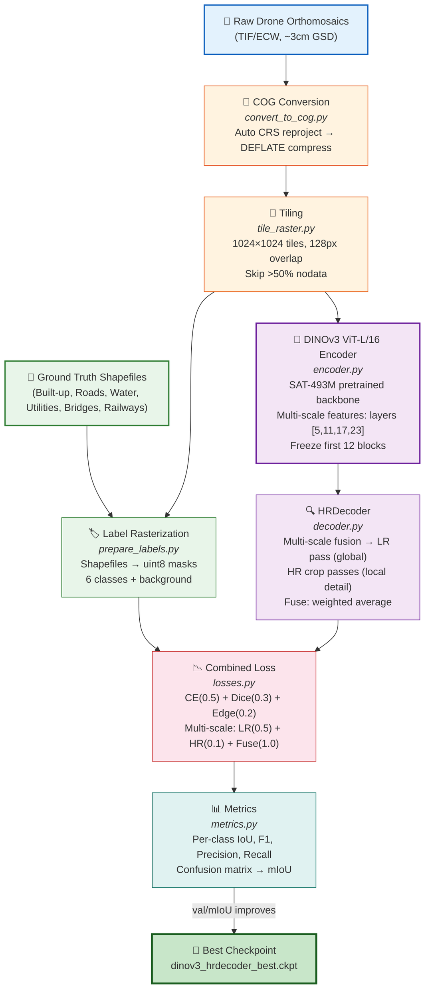
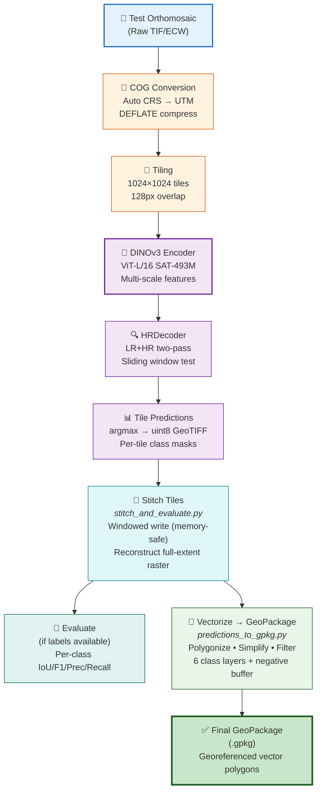
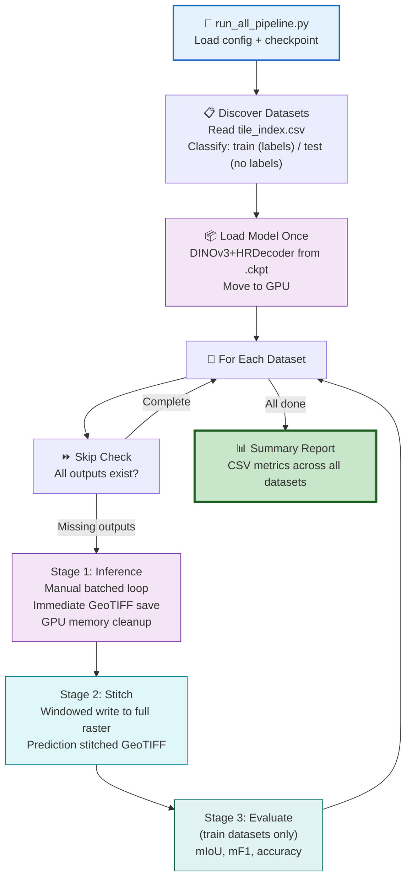
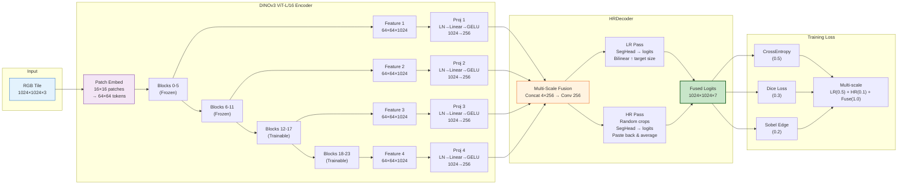
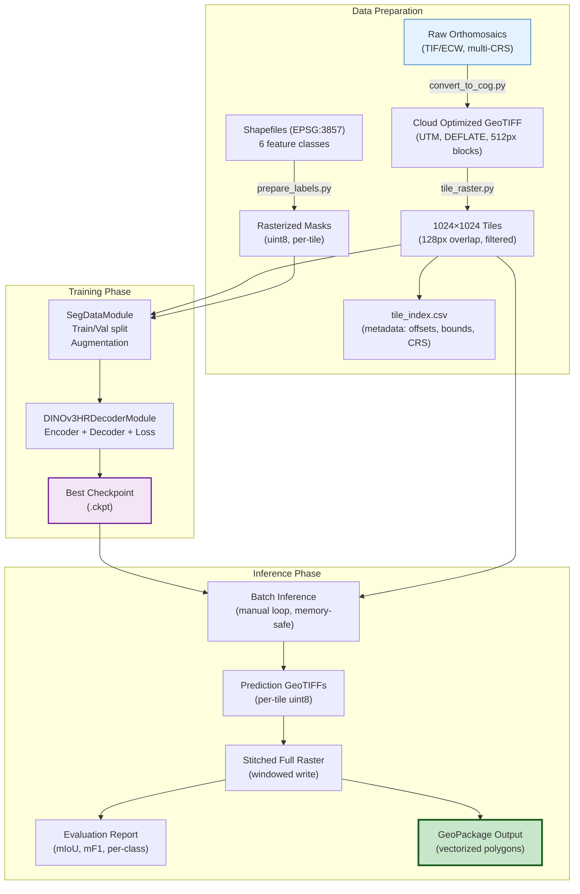

# SVAMITVA Feature Extraction: DINOv3 + HRDecoder Pipeline — Complete Documentation

> **Deep-learning framework for automated geospatial feature extraction from high-resolution drone orthomosaics**
> Multi-class semantic segmentation of Built-Up Areas, Roads, Water Bodies, Utilities, Bridges, and Railways

---

## Table of Contents

1. [Proposed Solution (Q4)](#4-proposed-solution)
2. [Uniqueness and Innovation (Q5)](#5-uniqueness-and-innovation)
3. [Technology Stack / Methodology (Q6)](#6-technology-stack--methodology)
4. [Implementation Plan / Roadmap (Q8)](#8-implementation-plan--roadmap)
5. [Required Resources (Q9)](#9-required-resources)
6. [Scalability and Sustainability (Q10)](#10-scalability-and-sustainability)
7. [Pipeline Flowcharts](#pipeline-flowcharts)
8. [Architecture Diagram](#architecture-diagram)
9. [Step-by-Step Usage Guide](#step-by-step-usage-guide)

---

## 4. Proposed Solution

We present an end-to-end deep-learning pipeline for automated geospatial feature extraction from high-resolution drone orthomosaics, purpose-built for the SVAMITVA scheme. The system takes raw drone imagery (TIF/ECW files, ~3 cm GSD) covering rural Indian villages and produces georeferenced GeoPackage files with vectorized feature polygons for six land-use classes: Built-Up Areas, Roads, Water Bodies, Utilities, Bridges, and Railways.

The core architecture pairs **DINOv3 ViT-L/16** (a satellite-pretrained Vision Transformer backbone with 300M+ parameters, pre-trained on 493 million satellite images) with an **HRDecoder** (High-Resolution Decoder) that performs two-pass inference — a low-resolution global pass for scene-level context and a high-resolution cropped pass for fine-grained boundary delineation. This dual-pass design is critical for accurately segmenting both large-area features (water bodies, built-up zones) and thin linear features (roads, railways, utility lines) from extremely high-resolution orthomosaics.

The pipeline is fully automated: raw orthomosaics are first converted to Cloud Optimized GeoTIFF (COG) format with automatic CRS reprojection, then tiled into 1024×1024 georeferenced patches with 128-pixel overlap. Ground-truth shapefiles are rasterized into multi-class masks for supervised training. The trained model performs tile-level inference, predictions are stitched back into full-extent rasters using windowed writing (constant memory), and finally vectorized into filtered, simplified GeoPackage polygons per feature class. The entire workflow supports fault-tolerant batch processing across 20+ datasets with automatic skip-resume capability.

---

## 5. Uniqueness and Innovation

Our approach introduces several innovations that distinguish it from existing RS segmentation methods:

**Satellite-Pretrained Foundation Model:** Unlike conventional CNNs (U-Net, DeepLab) trained from ImageNet, we leverage DINOv3 ViT-L/16 pre-trained on 493 million satellite images (SAT-493M weights). This domain-specific pretraining provides a dramatic advantage for remote sensing, as the model already understands spectral signatures, spatial patterns, and scale variations unique to aerial/satellite imagery — something ImageNet-pretrained models cannot offer.

**HRDecoder Two-Pass Fusion:** Our decoder performs both a full-image low-resolution pass (for global context) and multiple random high-resolution crop passes (for boundary precision), then fuses them — a strategy adapted from medical imaging where fine boundaries are equally critical. This uniquely addresses the challenge of segmenting thin linear features (roads, railways) alongside large-area features from the same tile.

**Edge-Aware Combined Loss:** Our multi-component loss (CrossEntropy + Dice + Sobel Edge) explicitly penalizes boundary misalignment using Sobel-filtered edge maps, producing crisper feature boundaries compared to standard CE-only losses. This is particularly important for road and railway delineation.

**Memory-Efficient Scalability:** The pipeline uses windowed GeoTIFF writing for stitching (avoiding 10+ GB in-memory allocations), manual batched inference with immediate tensor cleanup, and automatic fault-tolerant resume — enabling processing of datasets with 10,000+ tiles on constrained hardware.

---

## 6. Technology Stack / Methodology

### Deep Learning Framework
- **Backbone:** DINOv3 ViT-L/16 (Vision Transformer, 24 blocks, 1024-dim embeddings, patch size 16) with SAT-493M satellite-pretrained weights
- **Decoder:** HRDecoder — multi-scale feature fusion from ViT layers [5, 11, 17, 23] with learnable projection heads (LayerNorm → Linear → GELU), followed by LR/HR two-pass segmentation
- **Alternative Decoders:** UPerNet (FPN + PSP pooling), SegFormer (MLP-based), SkipDecoder (UNet-style) — all supported via a decoder registry
- **Training Framework:** PyTorch Lightning with mixed-precision (FP16), gradient accumulation, cosine LR scheduling with linear warmup, and differential learning rates (encoder: 0.1× base LR)

### Loss & Metrics
- **Loss:** Combined CrossEntropy (0.5) + Dice (0.3) + Sobel Edge (0.2) with multi-scale weighting for HRDecoder (LR: 0.5, HR: 0.1, Fuse: 1.0)
- **Metrics:** Per-class IoU, F1, Precision, Recall; mean IoU (mIoU); Overall Accuracy via confusion matrix accumulation

### Geospatial Stack
- **Rasterio** — georeferenced tile I/O, windowed reading/writing, CRS management
- **GDAL** — COG conversion, CRS reprojection (4326→UTM), format handling (ECW→GeoTIFF)
- **GeoPandas / Shapely** — shapefile parsing, spatial indexing, geometry operations, GeoPackage export
- **Rasterio.features** — rasterize (vector→raster for labels), shapes (raster→vector for predictions)

### Data Pipeline
- **Tiling:** 1024×1024 px tiles with 128 px overlap, nodata filtering (>50% threshold)
- **Augmentation:** Random flips, rotations (90°), brightness/contrast jitter
- **Normalization:** ImageNet statistics (mean=[0.485, 0.456, 0.406], std=[0.229, 0.224, 0.225])

---

## 8. Implementation Plan / Roadmap

### Data Preparation & Baseline
- Collect and validate raw drone orthomosaics from survey agencies (CG/PB regions)
- Convert to Cloud Optimized GeoTIFF format with automatic CRS standardization
- Tile all orthomosaics into 1024×1024 patches with overlap and nodata filtering
- Rasterize ground-truth shapefiles into pixel-level multi-class segmentation masks
- Establish geographic hold-out validation set (separate village dataset)

### Model Training & Optimization
- Fine-tune DINOv3 ViT-L/16 backbone with frozen first 12 blocks and trainable projections
- Train HRDecoder with combined CE+Dice+Edge loss and multi-scale supervision
- Hyperparameter search: learning rate (1e-4), batch size (4), tile size (512→1024), warmup epochs (5)
- Evaluate per-class mIoU, mF1, Precision/Recall with geographic cross-validation
- Full-training mode: retrain on all labeled data using best hyperparameters

### Pipeline Automation & Batch Processing
- Implement fault-tolerant multi-dataset inference pipeline with skip-resume capability
- Build tile-to-full-image stitching with memory-efficient windowed writing
- Deploy vectorization: raster predictions → filtered/simplified GeoPackage polygons
- Validate output georeferencing and cross-tile polygon merging

### Deployment & Scale
- Containerize pipeline for reproducible deployment (Docker + CUDA)
- Process all test datasets (20+ villages, 24,000+ tiles)
- Generate evaluation reports per dataset and cross-dataset summary
- Scale to new regions with transfer learning from SAT-493M backbone

---

## 9. Required Resources

### Compute Infrastructure
- **GPU:** NVIDIA RTX 4090 (24 GB VRAM) or A100 (40/80 GB) — required for DINOv3 ViT-L/16 inference and training at 1024×1024 resolution with mixed precision (FP16)
- **RAM:** Minimum 32 GB system RAM for large dataset stitching and GeoPackage export
- **Storage:** 500 GB+ SSD for tiles, predictions, and stitched outputs (NAS-mounted storage recommended for >20 datasets)

### Software Stack
- Python 3.10+, PyTorch 2.0+, PyTorch Lightning, CUDA 12+
- Geospatial: GDAL 3.6+, Rasterio, GeoPandas, Shapely
- DINOv3 local repository (facebook/dinov3) with SAT-493M pretrained weights

### Expertise
- Remote sensing / geospatial analysis for data preparation and validation
- Deep learning engineering for model training, optimization, and deployment
- GIS domain knowledge for shapefile handling and GeoPackage standardization

---

## 10. Scalability and Sustainability

### Scalability
The pipeline is designed for horizontal scaling across regions and datasets. The tiling architecture processes arbitrarily large orthomosaics by subdividing them into fixed-size patches, meaning the same pipeline handles 500 MB village images and 20 GB district images without code changes. The batch processing orchestrator (`run_all_pipeline.py`) can process 20+ datasets sequentially with automatic fault recovery, and the entire pipeline can be parallelized across multiple GPUs by simply splitting the dataset list.

The DINOv3 backbone, pretrained on 493 million satellite images spanning global geographies, provides strong transfer learning to unseen regions without retraining. For new states or terrain types, only the lightweight decoder (~10M parameters) requires fine-tuning, reducing adaptation time from weeks to hours.

### Sustainability
All components use open-source software (PyTorch, GDAL, Rasterio) with no proprietary dependencies. Model weights are publicly available through HuggingFace Hub. The pipeline produces standard GeoPackage output compatible with any GIS software (QGIS, ArcGIS). As higher-resolution drones or new feature classes emerge, the modular architecture allows swapping the backbone (e.g., to newer DINOv4) or adding decoder heads without redesigning the pipeline.

---

## Pipeline Flowcharts

### Training Pipeline Flowchart



### Inference Pipeline Flowchart



### Full Automated Batch Pipeline



---

## Architecture Diagram

### DINOv3 + HRDecoder Model Architecture



### Data Flow — End-to-End



---

## Step-by-Step Usage Guide

### Prerequisites

```bash
# Environment setup
conda create -n svamitva python=3.10
conda activate svamitva

# Core dependencies
pip install torch torchvision pytorch-lightning rasterio geopandas shapely
pip install pyyaml pillow huggingface-hub safetensors

# GDAL (for COG conversion)
sudo apt install gdal-bin  # Linux
# or: conda install -c conda-forge gdal

# Clone DINOv3 repo
git clone https://github.com/facebookresearch/dinov3.git models/dinov3
```

### Step 1: Prepare Raw Data

Organize raw drone orthomosaics into the workspace:

```
IIT_hackathon/
├── train/                          # Training orthomosaics
│   ├── *.tif / *.ecw              # Drone imagery files
│   ├── shp-file/                  # CG label shapefiles
│   └── PB_training_dataSet_shp_file/shp-file/  # PB labels
└── test/                          # Test orthomosaics
    └── *.tif / *.ecw
```

Run the dataset organizer to validate, de-duplicate, and classify rasters:

```bash
cd /home/gaurav/IIT_hackathon
python scripts/prepare_dataset.py
```

### Step 2: Convert to Cloud Optimized GeoTIFF

```bash
python scripts/convert_to_cog.py
```

This will:
- Auto-detect CRS for each raster
- Reproject EPSG:4326 → correct UTM zone
- Convert to COG with DEFLATE compression and 512px internal tiling
- Skip corrupt files and ECW without driver gracefully

### Step 3: Tile Rasters into Patches

```bash
python scripts/tile_raster.py
```

Configuration (in `configs/pipeline_config.yaml`):
- **Tile size:** 1024×1024 pixels
- **Overlap:** 128 pixels between adjacent tiles
- **Nodata threshold:** Skip tiles with >50% nodata
- **Output:** `tiles/<DATASET_NAME>/RRRR_CCCC.tif` + `tile_index.csv`

To tile a new single raster and append to the existing index:

```bash
python scripts/tile_append.py --input /path/to/new_raster.tif
```

### Step 4: Rasterize Ground Truth Labels

```bash
python scripts/prepare_labels.py --mode multiclass
```

This:
- Loads all shapefiles from configured label sources
- Reprojects to each tile's CRS (cached for efficiency)
- Uses spatial indexing for fast intersection queries
- Rasterizes geometries into multi-class uint8 masks
- Handles Point geometries (buffered to 3m radius) and all polygon types
- Updates `tile_index.csv` with `has_label` and `split` columns

### Step 5: Copy Masks to Pipeline Data Directory

```bash
# The prepare_masks.py script organizes masks into the pipeline's expected structure:
python dinov3_hrdecoder_pipeline/scripts/prepare_masks.py
```

This generates `data/masks/<DATASET>/` directories with mask files and a `label_index.csv`.

### Step 6: Train the Model

**Standard training** (with validation on held-out test dataset):

```bash
cd /home/gaurav/IIT_hackathon
python dinov3_hrdecoder_pipeline/scripts/train.py
```

**Full training** (all labeled data, no validation):

```bash
python dinov3_hrdecoder_pipeline/scripts/train_full.py
```

Key training parameters (from `configs/config.yaml`):

| Parameter | Value |
|-----------|-------|
| Tile size | 1024×1024 |
| Batch size | 4 |
| Max epochs | 50 |
| Learning rate | 1e-4 |
| Encoder LR multiplier | 0.1× |
| Weight decay | 1e-4 |
| Warmup epochs | 5 |
| Precision | FP16 mixed |
| Grad accumulation | 2 steps |
| Early stopping | 10 epochs patience |
| Encoder | DINOv3 ViT-L/16 (SAT-493M) |
| Decoder | HRDecoder |
| HR crop size | 256×256 |
| Loss | CE(0.5) + Dice(0.3) + Edge(0.2) |

Checkpoints are saved to `checkpoints/run_<TIMESTAMP>/`:
- `dinov3_hrdecoder_best_miou_*.ckpt` — Best by mIoU
- `dinov3_hrdecoder_best_acc_*.ckpt` — Best by accuracy
- `last.ckpt` — Latest epoch

### Step 7: Run Inference on All Datasets

```bash
python dinov3_hrdecoder_pipeline/scripts/run_all_pipeline.py
```

Options:

```bash
# Custom checkpoint
python .../run_all_pipeline.py --checkpoint /path/to/best.ckpt

# Specific datasets only
python .../run_all_pipeline.py --datasets NAGUL_450171_ORTHO BASANTPUR_434297_ORTHO

# Datasets from a text file
python .../run_all_pipeline.py --datasets-file dataset.txt

# Force reprocessing
python .../run_all_pipeline.py --force

# Skip SAM3 refinement (recommended)
python .../run_all_pipeline.py --skip-sam3
```

The pipeline processes each dataset through:
1. **Stage 1 — Inference:** Manual batched loop with immediate GeoTIFF save and GPU memory cleanup
2. **Stage 2 — Stitch:** Windowed write to full-extent GeoTIFF (constant memory)
3. **Stage 3 — Evaluate:** Per-class metrics against ground truth (training datasets only)

### Step 8: Convert Stitched Predictions to GeoPackage

```bash
python dinov3_hrdecoder_pipeline/scripts/batch_stitched_to_gpkg.py
```

This produces a GeoPackage (.gpkg) file per dataset containing:
- **Layers:** Built_Up_Area, Road, Water_Body, Utility, Bridge, Railway
- **Processing:** Polygonization, simplification, minimum area filtering
- **Utility negative buffer** applied to shrink Utility polygons

### Step 9: Review Results

Outputs are organized as:

```
final_results/
├── predictions/         # Per-tile prediction GeoTIFFs
│   └── <DATASET>/
│       ├── *_pred.tif
│       └── prediction_index.csv
├── stitched/            # Full-extent stitched rasters
│   └── <DATASET>_pred.tif
├── evaluation/          # Metrics reports
│   ├── <DATASET>_dinov3_metrics.csv
│   ├── <DATASET>_report.txt
│   └── summary_report.csv
├── gpkg/                # GeoPackage vector outputs
│   └── <DATASET>.gpkg
└── logs/                # Pipeline execution logs
    └── pipeline_run_<TIMESTAMP>.log
```

### Quick Reference: Minimal Inference on New Data

```bash
# 1. Tile the new raster
python scripts/tile_append.py --input /path/to/new_village.tif

# 2. Run inference (skip SAM3)
python dinov3_hrdecoder_pipeline/scripts/run_all_pipeline.py \
    --datasets NEW_VILLAGE_NAME \
    --skip-sam3

# 3. Convert to GeoPackage
python dinov3_hrdecoder_pipeline/scripts/batch_stitched_to_gpkg.py
```

---

## Class Definitions

| ID | Class | Color (RGB) | Description |
|----|-------|-------------|-------------|
| 0 | Background | — | Non-feature area |
| 1 | Built_Up_Area | (255, 0, 0) | Buildings, houses, structures |
| 2 | Road | (0, 255, 0) | Roads, paths, tracks |
| 3 | Water_Body | (0, 0, 255) | Ponds, rivers, canals |
| 4 | Utility | (255, 255, 0) | Poles, towers, utility structures |
| 5 | Bridge | (255, 0, 255) | Bridge structures |
| 6 | Railway | (0, 255, 255) | Railway lines and tracks |

---

## Key File Reference

| File | Purpose |
|------|---------|
| `models/encoder.py` | DINOv3 ViT-L/16 backbone wrapper with multi-scale feature extraction |
| `models/decoder.py` | HRDecoder + UPerNet + SegFormer + SkipDecoder implementations |
| `models/lightning_module.py` | PyTorch Lightning training/validation/prediction module |
| `models/losses.py` | Combined CE + Dice + Sobel Edge loss |
| `models/metrics.py` | Per-class IoU/F1/Precision/Recall with confusion matrix |
| `models/dataset.py` | Tile dataset with geographic train/val/test split |
| `configs/config.yaml` | Full pipeline configuration |
| `scripts/train.py` | Standard training with validation |
| `scripts/train_full.py` | Full training (all data, no val) |
| `scripts/run_all_pipeline.py` | Batch inference + stitch + evaluate pipeline |
| `scripts/stitch_and_evaluate.py` | Tile stitching + metrics computation |
| `scripts/predictions_to_gpkg.py` | Raster → GeoPackage vectorization |
| `scripts/prepare_dataset.py` | Dataset validation and organization (root) |
| `scripts/prepare_labels.py` | Shapefile → raster mask generation (root) |
| `scripts/convert_to_cog.py` | COG conversion with CRS handling (root) |
| `scripts/tile_raster.py` | Raster → tile patches (root) |
| `scripts/tile_append.py` | Append single raster tiles to index (root) |
