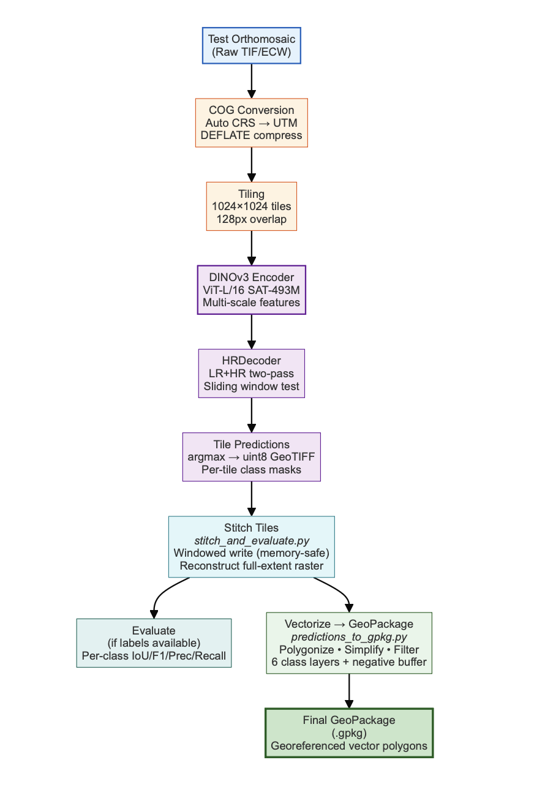

# `inference/` — infer → stitch → evaluate → vectorise

Takes a trained checkpoint and turns tiles into GIS-ready products: per-tile
masks → a memory-safe stitched raster → per-class metrics → a multi-layer
GeoPackage. Also home to the timing hooks the portal parses for its live
progress bar. Run from the **repo root** with `conda activate svamitva2`.



```
tiles/ + tiles/tile_index.csv          checkpoint (pretrained/*.ckpt)
        │
        │  run_pipeline.py   (one model load, loops all datasets)
        ├─ Stage 1  infer.py-style batched inference (FP16 autocast)
        │     → outputs/predictions/<ds>/*_pred.tif + prediction_index.csv
        ├─ Stage 2  stitch_and_evaluate.stitch_predictions (windowed writes)
        │     → outputs/stitched/<ds>_pred.tif
        └─ Stage 3  stitch_and_evaluate.evaluate_tile_predictions (train only)
              → outputs/evaluation/<ds>_metrics.csv (+ report.txt, summary_report.csv)
        │
        │  batch_stitched_to_gpkg.py   (or predictions_to_gpkg.py)
        ▼
outputs/gpkg/<ds>_pred.gpkg            (per-class polygon/line/point layers + QGIS styles)
```

| File | Role | CLI? |
|---|---|---|
| `run_pipeline.py` | Batch orchestrator: infer → stitch → evaluate over all datasets. | ✔ |
| `stitch_and_evaluate.py` | Memory-safe windowed stitching + tile-level metrics (functions reused by `run_pipeline`). | ✔ |
| `predictions_to_gpkg.py` | Rasters → GeoPackage: polygons, road skeletons, water lines/points, QGIS styles. | ✔ |
| `batch_stitched_to_gpkg.py` | Batch GPKG export (filtered layer set) + Utility de-blobbing. | ✔ |
| `infer.py` | Simpler single-dataset inference via Lightning `Trainer.predict`. | ✔ |
| `evaluate_iou.py` | Vector-based building-only IoU/P/R/F1 (area-overlap, not tile-mask). | ✔ |
| `_timing.py` | `StepTimer` — the `⏱ … START/DONE` lines the portal regex-parses. | library |

---

## `run_pipeline.py` — the main driver

```bash
python -m dinov3_hrdecoder_pipeline.inference.run_pipeline \
    --checkpoint pretrained/dinov3_hrdecoder_full_best_loss=0.0615.ckpt
```

| Flag | Default | Effect |
|---|---|---|
| `--config` | `configs/train_full.yaml` | Config path. |
| `--checkpoint` | `pretrained/dinov3_hrdecoder_full_best_loss=0.0615.ckpt` | Model checkpoint. |
| `--output-dir` | `outputs/` | Base output directory. |
| `--datasets NAME …` | all | Run only the listed datasets. |
| `--datasets-file FILE` | — | One dataset name per line. |
| `--skip-stitch` | off | Skip the stitching stage. |
| `--force` | off | Re-process even if outputs exist. |

- **Datasets** are discovered from `tile_index.csv` and classified `train` (has `*_mask.tif` under `labels_dir/<ds>/`, so it gets metrics) vs `test` (predictions + stitch only). The model is **loaded once** and reused across all datasets.
- **FP16 autocast** inference (`torch.autocast(cuda, float16)`), then cast back to FP32 before `argmax` so labels are bit-identical — ~50 % latency cut on Ampere/Ada. GPU cache (`gc.collect()` + `empty_cache()`) is flushed **every 50 batches** and after each dataset → constant VRAM. A manual batched loop (not `Trainer.predict`) avoids accumulating 10k+ prediction tensors.
- **Checkpoint architecture guard** — before building the model, `_checkpoint_decoder_type` mmaps the checkpoint and reads only its state-dict **key names** (cheap for multi-GB files): `decoder.seg_head`+`decoder.fusion.` ⇒ hrdecoder; `decoder.cls_seg`+`psp/fpn/lateral` ⇒ upernet; `decoder.linear_fuse/linear_c` ⇒ segformer. If it doesn't match `model.decoder.type`, it `sys.exit(2)` instead of producing garbage.
- **Skip-resume** — unless `--force`, a dataset is skipped when `prediction_index.csv`, the stitched `.tif` (unless `--skip-stitch`), and (train only) `<ds>_metrics.csv` all exist — so an interrupted 20-village run resumes cleanly. Per-dataset errors are caught and logged; the run continues.
- **Outputs:** `predictions/<ds>/*_pred.tif` + `prediction_index.csv` (columns `tile_path, pred_path`); `stitched/<ds>_pred.tif`; `evaluation/<ds>_metrics.csv` (columns `source, metric, value`) + `_report.txt`; `evaluation/summary_report.csv` (columns `dataset, mIoU, mF1, mPrecision, mRecall, overall_accuracy`); `logs/pipeline_run_<ts>.log` (tee'd stdout).
- Prints per-dataset stage timings and a full `StepTimer` summary at the end.

## `stitch_and_evaluate.py` — windowed stitch + metrics

```bash
python -m dinov3_hrdecoder_pipeline.inference.stitch_and_evaluate [--eval-only]
```

Standalone driver (reads `configs/train.yaml`, uses its `test_dataset`); its
`stitch_predictions()` and `evaluate_tile_predictions()` are also imported by
`run_pipeline.py`.

- **Memory-safe stitching:** reconstructs the full-extent raster by **windowed writes** (512² blocks, DEFLATE, tiled) — never holds the whole array, avoiding the ~10+ GB float allocation a 10,523-tile village would need. It prints the in-memory GB it avoided.
- **Overlap resolved last-write-wins** (labels are discrete; averaging would create non-integer classes). Georeferencing is recovered via a cascade: source raster → first tile's transform+offset → tile_index bounds → (warns) no georef.
- **Evaluation** parallelises tile I/O with a `ThreadPoolExecutor` (rasterio releases the GIL); metric accumulation is serial. Tiles with missing pred/mask or empty GT are skipped. `num_classes = len(classes)+1`.

## `predictions_to_gpkg.py` — raster → GeoPackage (full layer set)

```bash
# From per-tile predictions (recommended — faster, dissolves seams):
python -m dinov3_hrdecoder_pipeline.inference.predictions_to_gpkg \
    --pred-dir outputs/predictions/<DATASET> --output <DATASET>.gpkg
# …or from a stitched raster:
python -m dinov3_hrdecoder_pipeline.inference.predictions_to_gpkg \
    --input outputs/stitched/<DATASET>_pred.tif
```

`--pred-dir` and `--input` are mutually exclusive (one required). Other flags:
`--output`, `--config`, `--simplify` (tol, default 0), `--min-area` (default
0), `--point-area-threshold` (default 100), `--pred-suffix` (`_pred.tif`),
`--no-dissolve`, `--workers` (default 1), `--downsample` (default 1),
`--tile-index`, `--dataset`.

- **Vectorisation:** `rasterio.features.shapes` per class → simplify (Douglas-Peucker, `preserve_topology`) + min-area filter. **Roads/lines are skeletonised** (`skimage.morphology.skeletonize`) into centre-lines; small polygons (< `point-area-threshold`) become **points**. Tiles polygonised in parallel (rasterio releases the GIL) and dissolved across seams with `unary_union`.
- **Layers** (name = training shapefile name): `Built_Up_Area_type` (poly); `Road` (poly) + `Road_Centre_Line` (line); `Water_Body` (poly) + `Water_Body_Line` (line) + `Waterbody_Point` (point); `Utility_Poly` (poly) + `Utility` (point); `Bridge` (poly); `Railway` (line). Plus a **`layer_styles`** table so QGIS opens the GeoPackage pre-coloured.

## `batch_stitched_to_gpkg.py` — batch export (filtered layers)

```bash
python -m dinov3_hrdecoder_pipeline.inference.batch_stitched_to_gpkg \
    --file-list datasets.txt --stitched-dir outputs/stitched
```

| Flag | Default | Effect |
|---|---|---|
| `--file-list` | **required** | Text file, one dataset name per line (`#` comments ok). |
| `--stitched-dir` | **required** | Directory of stitched `*_pred.tif` / `*_refined.tif`. |
| `--output-dir` | sibling `gpkg/` | Where GPKGs are written. |
| `--config` | `configs/train.yaml` | Config path. |
| `--utility-buffer` | `-1.0` | Negative buffer to shrink over-grown `Utility_Poly` blobs; `0` skips. |
| `--workers` | 1 | Parallel workers for per-class processing. |
| `--downsample` | 1 | Read each raster at 1/N res before polygonising. |
| `--simplify` / `--min-area` | 0 / 0 | Applied inside each worker. |

- Emits `<ds>_pred.gpkg` and `<ds>_refined.gpkg` with a **filtered layer set** (no road centre-line, no water line/point — just the headline polygons + Utility point + Railway line). Auto-uses the **fast per-tile path** (`tiles_to_gpkg`) when `../predictions/<ds>/` still exists (5–20× faster), else polygonises the full stitched raster.
- Writes to a local `/tmp` temp `.gpkg` then `shutil.move`s it into place (avoids SQLite failures on network filesystems). Exits non-zero only if **every** conversion failed — so the portal won't delete stitched rasters after an all-empty run.

## `infer.py` — simple single-dataset inference

```bash
python -m dinov3_hrdecoder_pipeline.inference.infer --checkpoint <path> [--config configs/train.yaml]
```

Runs the config's `test_dataset` via Lightning `Trainer.predict`, writing
`outputs/predictions/<test_dataset>/*_pred.tif` + `prediction_index.csv`. No
stitching, no metrics, no architecture guard — `run_pipeline.py` is the
production path; `infer.py` is the minimal predecessor.

## `evaluate_iou.py` — vector building-IoU

```bash
python -m dinov3_hrdecoder_pipeline.inference.evaluate_iou \
    [--pred-dir DIR] [--gt-shp SHP …] [--tile-index CSV] [--output-csv CSV]
```

Area-overlap IoU/precision/recall/F1 for **buildings only**, comparing
decomposed prediction shapefiles against GT `Built_Up_Area_type` shapefiles.
Clips both to each dataset's AOI (from `tile_index.csv`) before `unary_union`,
so it doesn't union over an entire state. Defaults for all paths resolve from
`configs/train.yaml`. Output CSV columns: `dataset, pred_file, pred_area,
gt_area, intersection_area, union_area, iou, precision, recall, f1` with a
final `OVERALL` row.

## `_timing.py` — `StepTimer` (portal integration)

Not a CLI. Prints the timing lines the pipeline emits and the portal's
`pipeline_runner.py` regex-parses into live SSE progress events:

```
    ⏱  [09:14:38] START  inference / batch loop
    ⏱  [09:21:53] DONE   inference / batch loop  (435.12s)
    ⏱  [09:21:53] cumulative inference / forward pass per batch: 380.2s over 330 call(s)
```

> **If you rename a timing label or add a stage, update both `_timing.py`
> (emitter) and the portal's `pipeline_runner.PHASES` (parser).**
