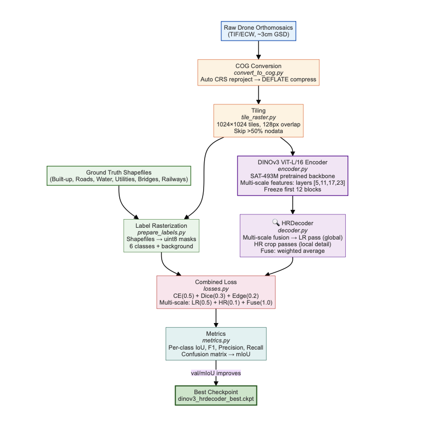

# `training/` — train the DINOv3 + HRDecoder model

Three entrypoints, one model. They differ only in **how the data is split**
and **which checkpoints are saved**; the architecture, loss, LR schedule and
augmentation are identical (all defined in [`models/`](../models/)). Run
from the **repo root** with `conda activate svamitva2`.



| Script | Validation hold-out | Early stopping | Saves | Output dirs |
|---|---|---|---|---|
| `train.py` | **1** village (`test_dataset`) | on `val/mIoU`, patience 10 | best mIoU (+`last`), best accuracy | `checkpoints/run_<ts>/`, `logs/run_<ts>/` |
| `train_2val.py` | **2** villages (`test_datasets`) | on `val/mIoU`, patience 10 | best mIoU (+`last`), best accuracy, best `val/loss` | `checkpoints_2val/run_<ts>/`, `logs_2val/run_<ts>/` |
| `train_full.py` | **none** (all labelled tiles) | **disabled** | best `train/loss` (+`last`) | `checkpoints/full_train_<ts>/`, `logs/full_train_<ts>/` |

> **Validation is a geographic dataset hold-out, not a random % split.** The
> named village(s) are pulled out entirely for validation/test; every other
> labelled tile trains. See [`models/dataset.py`](../models/) → `SegDataModule`.

**The submission model was produced by `train_full.py`** →
`dinov3_hrdecoder_full_best_loss=0.0615.ckpt` (all 10 villages, 50 epochs,
best `train/loss`).

---

## Commands

All three share `--config`, `--gpus` (int, default 1), and `--resume PATH`.

```bash
# Standard: 1 held-out village as validation, early stopping on val/mIoU
python -m dinov3_hrdecoder_pipeline.training.train \
    [--config configs/train.yaml] [--gpus 1] [--resume PATH]

# Two held-out villages, three "best" checkpoints (mIoU / accuracy / val-loss)
python -m dinov3_hrdecoder_pipeline.training.train_2val \
    [--config configs/train_2val.yaml] [--gpus 1] [--resume PATH]

# Full data, no validation, fixed 50-epoch budget — the submission model
python -m dinov3_hrdecoder_pipeline.training.train_full \
    [--config configs/train_full.yaml] [--gpus 1] [--resume PATH] [--epochs N]
```

`train_full.py` additionally accepts `--epochs N` to override
`training.max_epochs` from the config.

---

## Hyper-parameters (from `configs/train*.yaml`)

| Knob | Value | Why |
|---|---|---|
| Framework / precision | PyTorch Lightning, **16-mixed (FP16)** | Fits ViT-L at 1024² on 24 GB; ~2× throughput. |
| Tile / batch / grad-accum | 1024² / **4** / **2** → **effective batch 8** | Largest stable config on 24 GB. |
| Optimizer | **AdamW**, `weight_decay 1e-4` | Standard for ViT fine-tuning. |
| Base LR / encoder LR | `1e-4` / **`1e-5` (0.1×)** | Differential LR protects pretrained features. |
| Scheduler | **Cosine** (`η_min 1e-7`) + **5-epoch linear warmup** (`start 0.01×`) | Warmup avoids early divergence on unfrozen blocks. |
| Grad clip | **1.0** | Guards FP16 spikes. |
| Epochs | **50** (no early stopping in `train_full`) | Fixed budget for the submission run. |
| Frozen | patch-embed + first 12 of 24 blocks | Stability + speed. |
| Loss | `0.5·CE + 0.3·Dice + 0.2·Edge`, multi-scale `1.0·Fuse + 0.5·LR + 0.1·HR` | See [`models/losses.py`](../models/). |

**Param budget (≈):** ~300 M total; **~155 M trainable** (top-12 ViT blocks +
4 projections + HRDecoder). The **task head alone (projections + decoder) is
~3 M** — for a new region you can freeze the whole encoder and retrain only
that head.

---

## What each run produces

- **Checkpoints** with the metric baked into the filename, e.g.
  `dinov3_hrdecoder_hrdecoder_miou=0.7286_acc=0.9514.ckpt` (from `train.py`)
  or `dinov3_hrdecoder_full_best_loss=0.0615.ckpt` (from `train_full.py`),
  plus a `last.ckpt`. Each is ~2.3 GB.
- **Loggers:** TensorBoard + CSV under the run's `logs*/` dir. The Lightning
  module also appends an `epoch_metrics_summary.txt` per epoch.
- **Callbacks:** `ModelCheckpoint`(s), `LearningRateMonitor(step)`,
  `RichProgressBar`, and (except `train_full`) `EarlyStopping(val/mIoU)`.

> Runs are **not seeded** (`deterministic=False`), so exact numbers vary
> slightly across runs. Continue an interrupted run with `--resume PATH`.

Once you have a checkpoint, run inference with
[`inference/run_pipeline.py`](../inference/) (which defaults to
`configs/train_full.yaml` and the submission checkpoint).
